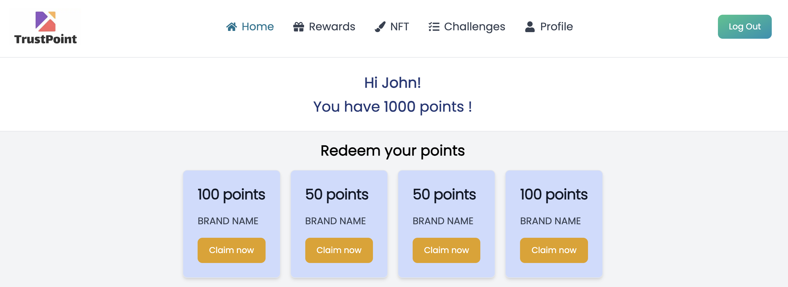

# TrustPoint

TrustPoint revolutionizes loyalty programs with blockchain technology. This dApp allows brands to create token-based rewards, supporting permissionless co-branding to attract new customers. Users earn and redeem points across brands, leveraging NFTs for transferable rewards.

Unique Value Proposition: TrustPoint redefines customer engagement by enabling permissionless, co-branded loyalty programs. This innovative approach allows brands to target token holders from other brands, acquiring new customers effortlessly without the need for negotiations. Additionally, TrustPoint enhances user privacy by giving customers the choice to disclose personal information in exchange for rewards, fostering trust and transparency.



## Set-up

### Deploy Front-end

- Open a terminal, clone the project & go to the `front` directory:

```
$ git clone https://github.com/linnnnnnh/TrustPoint
```

```
$ cd TrustPoint/front
```

- Install dependencies:

```
$ npm install
```

- Deploy front-end:

```
$ npm run dev
```

That's it! Now you can go to [http://localhost:3000/](http://localhost:3000/) and interact with the application!

### Technology used

**Sign Protocol** (https://app.sign.global/): we expand the capabilities of loyalty programs by incorporating Sign Protocol, an attestation protocol that verifies on-chain information. This integration manifests in two key features:
1. Secure Reward Redemption: Before redeeming rewards in-store or online, a customer presents a QR code or uses NFC technology. TrustPoint automatically verifies whether the customer has enough points for the reward using Sign Protocol, which then generates an verifiable attestation.
2. Targeted Marketing Opportunities: Brands can identify potential customers by accessing a list of wallet addresses that have engaged with specific brands, thanks to verified information from Sign Protocol. This allows for highly targeted marketing with just a few clicks, without compromising user privacy.

### Deploy smart-contracts

The smart-contracts are already deployed, you can find them at these addresses:

- **Arbitrum Sepolia**:
    - FactoryContract: **0xDf1b12Efbc559ace5a86a1A5F9d97389B62B9984**
    - CustomerContract: **0x4c491aBC0Ae7D76466999c8876D2901B4Ede3d7A**

- **Gnosis Chiado**:
    - FactoryContract: **0xd74DA75E8Fd52f1bFac615f01Fe1ea96c679bbe8**
    - CustomerContract: **0x7F8fb89Ed62069FA4b5972C4804bAec563Db0cb5**

#### If you want to deploy the smart-contracts by yourself you can follow these tutorials:

- [Deploy on Arbitrum Sepolia](./docs/README.deploy.arbitrum.md)
- [Deploy on Gnosis Chiado](./docs/README.deploy.gnosis.md)
